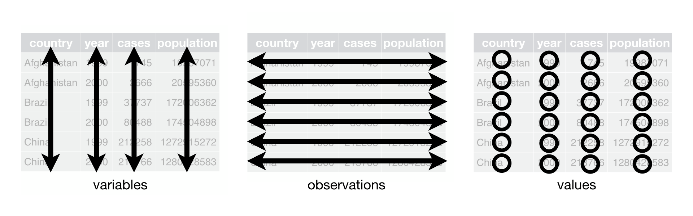

```{r setup-locale, include=FALSE}
Sys.setenv(LANGUAGE = "ru_RU.UTF-8")
Sys.setlocale("LC_ALL", "Russian")
```

```{r setup, include=FALSE}
library(learnr)
library(gradethis)
library(tutorial.helpers)
library(tidyverse)
library(knitr)
library(palmerpenguins)
library(ggthemes) 

knitr::opts_chunk$set(echo=FALSE)
knitr::opts_chunk$set(out.width = '90%')
```

```{r copy-code-chunk, child = system.file("child_documents/copy_button.Rmd", package = "tutorial.helpers")}
```

```{r info-section, child = "child_documents/info_section.Rmd"}
```

## Введение

Сегодня ни одно исследование не может обойтись без качественной визуализации, и уметь создавать качественные иллюстрации к данным так же важно, как и владеть статистическими методами анализа.

В рамках данного тьюториала мы глубже познакомимся с возможностями пакета [**ggplot2**](https://ggplot2.tidyverse.org/index.html), специально разработанного для создания графиков по принципам «грамматики графики» (Grammar of Graphics). Мы изучим основные функции, включая [`ggplot()`](https://ggplot2.tidyverse.org/reference/ggplot.html), [`geom_point()`](https://ggplot2.tidyverse.org/reference/geom_point.html), [`geom_bar()`](https://ggplot2.tidyverse.org/reference/geom_bar.html), [`geom_boxplot()`](https://ggplot2.tidyverse.org/reference/geom_boxplot.html), [`geom_histogram()`](https://ggplot2.tidyverse.org/reference/geom_histogram.html), и другие.
 
Основной теоретический материал для чтения содержится в соответствующем разделе учебного пособия [_R в социологических исследованиях_](https://domelia.github.io/R-book/Base_ggplot2.html).

Материалы и упражнения, представленные в практической работе, частично воспроизводят обучающие материалы из [_R for Data Science_](http://r4ds.had.co.nz/) и вдохновлены материалами, представленными разработчиками пакета [learnr](https://rstudio.github.io/learnr/).

```{r eval = FALSE}
library(tidyverse) #  сразу загружает dplyr, ggplot2, и другие пакеты.
```

## Первые шаги

В R есть разные возможности для создания графиков, но [**ggplot2**](https://ggplot2.tidyverse.org/index.html) – одна из наиболее элегантных и гибких систем. Пакет **ggplot2** основан на так называемой «графической грамматике» - *grammar of graphics* (отсюда **gg** в названии) - системе правил для описания и построения графиков. С **ggplot2**, вы сможете создавать различные визуализации, основанные на сходных принципах. Основными преимуществами **ggplot2** являются:

- гибкость;
- масштабируемость;
- консистентность (единый синтаксис и правила написания кода, согласующиеся с `tidyverse`);
- возможность интеграции напрямую с даннымм;
- наличие большого количества расширений, позволяющих создавать геопространственные, сетевые, анимированные и другие виды графиков.


Давайте создадим график на основе датасета `penguins` из пакета `palmerpenguins`. Датасет был собран в 2007–2009 годах доктором Кристен Горман в рамках программы Palmer Station LTER (Palmer Archipelago, Западная Антарктида) для изучения поведения трех видов пингвинов: Адели (Adelie), Генту (Gentoo) и Чинстрап (Chinstrap). Оригинальные данные хранились раздельно, но в 2020 году их объединили в пакет `palmerpenguins` как современную замену `iris` — с 344 наблюдениями, 8 переменными (размеры тела, пол, остров, год и др.).

Хотя это не совсем социологические данные, сами пингвины – высоко социальные животные, живущие в крупных колониях (до миллионов особей) с развитой коммуникацией, кооперацией и иерархиями.

В наборе есть следующие переменные:


| Переменная | Тип | Описание |
| :-- | :-- | :-- |
| species | factor | Вид пингвина: Adelie, Chinstrap, Gentoo |
| island | factor | Остров: Biscoe, Dream, Torgersen |
| bill_length_mm | numeric | Длина клюва (мм) |
| bill_depth_mm | numeric | Глубина клюва (мм) |
| flipper_length_mm | integer | Длина ласта (мм) |
| body_mass_g | integer | Масса тела (г) |
| sex | factor | Пол: male, female (есть NA) |
| year | integer | Год сбора: 2007, 2008, 2009 |


{width=400px}

{width=400px}

{width=400px}

В качестве первого упражнения давайте попробуем сделать вот такой график в стиле журнала The Economist:

```{r}
intro_p <- penguins |>
  drop_na() |> 
  ggplot(mapping = aes(x = flipper_length_mm, 
                       y = body_mass_g)) +
    geom_point(mapping = aes(color = species, 
                             shape = species)) +
  geom_smooth(method = "lm", formula = y ~ x) +
    labs(title = "Масса тела и длина ласт",
         subtitle = "Биометрические данные для видов Adelie, Chinstrap и Gentoo",
         x = " Длина ласт (мм)", 
         y = "Масса тела (г)",
         color = "Вид", 
         shape = "Вид")+
  theme_economist() + 
  scale_color_tableau()+
   theme(plot.title = element_text(vjust = +2))
intro_p
```

### Упражнение 1

Загрузите библиотеки [**tidyverse**](https://tidyverse.tidyverse.org/), [**palmerpenguins**](https://allisonhorst.github.io/palmerpenguins/), а также расширение для `ggplot2` [**ggthemes**](https://jrnold.github.io/ggthemes/) с помощью функции `library()`.

```{r first-steps, exercise = TRUE }

```

```{r first-steps-hint-1, eval = FALSE}
library(...)
library(...)
library(...)
```

```{r first-steps-test, include = FALSE}
library(tidyverse)
library(palmerpenguins)
library(ggthemes)
```

```{r first-steps-solution, include = FALSE}
library(tidyverse)
library(palmerpenguins)
library(ggthemes)
```

```{r first-steps-code-check}
grade_code()
```


### 

Пингвины с более длинными ластами весят больше или меньше, чем пингвины с более короткими ластами? Как выглядит связь между длиной ласта и массой тела? Она положительная? Отрицательная? Линейная? Нелинейная? Различается ли эта связь в зависимости от вида пингвина? А от острова, на котором он живёт?


### Упражнение 2

Наберите `penguins` и запустите кнопку "Выполнить код". Внимательно изучите данные в таблице

```{r first-steps-2, exercise = TRUE}

```

```{r first-steps-2-hint-1, eval = FALSE}
penguins
```

```{r first-steps-2-test, include = FALSE}
penguins
```

```{r first-steps-2-solution, include = FALSE}
penguins
```


```{r first-steps-2-code-check}
grade_code
```
### 

Мы видим, что таблица с данными о пингвинах подходит под описание `tidy` - чистых даннных, так как:

1. Каждая переменная в своем столбце; и каждый столбец это отдельная переменная
2.  Каждое наблюдение это строка и каждая строка тоже наблюдение, соответственно.
3.  Каждое значение находится в своей собственной ячейке, и каждая ячейка имеет только одно значение

```{r}

```


### Упражнение 3

Базовой функцией пакета [**ggplot2**](https://ggplot2.tidyverse.org/index.html)  является `ggplot()`, она создает объект *ggplot*, который служит канвой для визуаизаций, таких как диаграмма рассеяния или боксплот. 

Запустите код `ggplot(data = penguins)`.

```{r first-steps-3, exercise = TRUE}

```

```{r first-steps-3-hint-1, eval = FALSE}
ggplot(...)
```

```{r first-steps-3-test, include = FALSE}
ggplot(data = penguins)
```

```{r first-steps-3-solution, include = FALSE}
ggplot(data = penguins)
```

```{r first-steps-3-code-check}
grade_code()
```

### 

Мы видим пустой серый квадрат. R установил область, в которой мы можем разместить график, но мы еще пока не сообщили программе, что именно мы хотим сделать.


###  Упражнение 4

Присоедините `penguins` к `ggplot()`с помощью пайпа ` |> `- оператора, разбивающего код на строки, что делает его более читабельным . 

```{r first-steps-4, exercise = TRUE}

```

```{r first-steps-4-hint-1, eval = FALSE}
penguins |> 
  ...
```

```{r first-steps-4-test, include = FALSE}
penguins |>
  ggplot()
```

```{r first-steps-4-solution, include = FALSE}
penguins |>
  ggplot()
```

```{r first-steps-4-code-check}
grade_code()
```

### 
Хотя в рамках лекции мы обсуждали, что библиотека `ggplot2` не поддерживает пайпинг внутри кода, создающего график, но ничто не мешает нам с помощью пайпа присоединить функции ggplot2 к самим данным. Такой способ представления аналогичен конструкции `ggplot(data = penguins). 


### 

Параметр `mapping` позволяет осуществить сопоставление между столбцами данных и отдельными частями графика, например, установить, какие переменные будут располагаться на осях x и y.

Внутри `mapping` нужно обязательно задать `ggplot()` *эстетику* через вызов функции `aes()`. Например, если Вы хотите установить переменную по оси x - `категория`, вам нужно добавить `mapping = aes(x = категория)` в функцию `ggplot()`. 

### Упражнение 5

Скопируйте код из предыдущей ячейки, установите в параметре "эстетика" по оси `x` переменную `flipper_length_mm`, по оси`y` - переменную `body_mass_g`, а затем запустите код. 

```{r first-steps-5, exercise = TRUE}


```

```{r first-steps-5-hint-1, eval = FALSE}
penguins |>
  ggplot(mapping = aes(x = ..., 
                       y = ...))
```

```{r first-steps-5-test, include = FALSE}
penguins |>
  ggplot(mapping = aes(x = flipper_length_mm, 
                       y = body_mass_g))
```


```{r first-steps-5-solution, include = FALSE}
penguins |>
  ggplot(mapping = aes(x = flipper_length_mm, 
                       y = body_mass_g))
```

```{r first-steps-5-code-check}
grade_code()
```

### 

Чтобы отобразить данные нам требуется добавить геометрический объект, или, в терминах ggplot, геом - `geom`. Все геомы доступны в **ggplot2** с помощью функций, которые начинаются с префикса `geom_`.

### Упражнение 6

Функция `geom_point()` добавляет на график слой с точками, что позволяет создать диаграмму рассеяния. Скопируйте предыдущий код и добавьте строчку `+ geom_point()`. 

```{r first-steps-6, exercise = TRUE}

```

<button onclick="transfer_code(this)">Скопировать код</button>

```{r first-steps-6-hint-1, eval = FALSE}
penguins |>
  ggplot(mapping = aes(x = flipper_length_mm, 
                       y = body_mass_g)) +
  ...
```

```{r first-steps-6-test, include = FALSE}
penguins |>
  ggplot(mapping = aes(x = flipper_length_mm, 
                       y = body_mass_g)) +
    geom_point() 
```

```{r first-steps-6-solution, include = FALSE}
penguins |>
  ggplot(mapping = aes(x = flipper_length_mm, 
                       y = body_mass_g)) +
    geom_point() 
```

```{r first-steps-6-code-check}
grade_code()
```

### 

Обратите внимание на предупреждение. В наших данных есть два проблемных наблюдения. В реальных исследовательских условиях, мы бы постарались разобраться, чего не хватает и по каким причинам. Для целей данного тьюториала, просто уберем эти данные с помощью функции `drop_na()`.  

`drop_na()` удаляет все строки с пропущенными значениями - NA, независимо от того, в какой переменной они находятся. Если передать в `drop_na()` имя конкретной переменной в качестве аргумента, R удалит только строки, в которых значения NA находятся в данной переменной.

### Упражнение 7

Включите строку `drop_na() |>` между выражением `penguins |>` и `ggplot(mapping = ...)`.

```{r first-steps-7, exercise = TRUE}

```

<button onclick="transfer_code(this)">Скопировать код</button>

```{r first-steps-7-hint-1, eval = FALSE}
penguins |>
  ... |> 
  ggplot(mapping = aes(x = flipper_length_mm, 
                       y = body_mass_g)) +
    geom_point() 
```

```{r first-steps-7-test, include = FALSE}
penguins |>
  drop_na() |> 
  ggplot(mapping = aes(x = flipper_length_mm, 
                       y = body_mass_g)) +
    geom_point() 
```

```{r first-steps-7-solution, include = FALSE}
penguins |>
  drop_na() |> 
  ggplot(mapping = aes(x = flipper_length_mm, 
                       y = body_mass_g)) +
    geom_point() 
```

```{r first-steps-7-code-check}
grade_code()
```

### 

Функция эстетики  `aes()`  имеет не только параметры  `x` и `y`, но и такие как `color` (цвет), `shape` (форма) и  `size` (размер). Мы можем добавить их таким же способом, как мы добавляли параметры `x` и `y`.


### Упражнение 8

Скопируйте код из предыдущей ячейки. Установите параметр `color` равным `species` и запустите код. 

```{r first-steps-8, exercise = TRUE}

```

```{r first-steps-8-hint-1, eval = FALSE}
penguins |>
  drop_na() |> 
  ggplot(mapping = aes(x = flipper_length_mm, 
                       y = body_mass_g, 
                       color = ...)) +
    geom_point()
```

```{r first-steps-8-test, include = FALSE}
penguins |>
  drop_na() |>
  ggplot(mapping = aes(x = flipper_length_mm, 
                       y = body_mass_g,
                       color = species)) +
    geom_point() 
```

```{r first-steps-8-solution, include = FALSE}
penguins |>
  drop_na() |>
  ggplot(mapping = aes(x = flipper_length_mm, 
                       y = body_mass_g,
                       color = species)) +
    geom_point() 
```

```{r first-steps-8-code-check}
grade_code()
```

### 

Диаграммы рассеяния полезны, чтобы исследовать взаимосвязи между переменными `x` и `y`, но нам может быть также полезно узнать, как другие переменные влияют на эту взаимосвязь. Например, мы можем спросить себя: отличается ли связь между `x` и `y` для различных видов пингвинов?

Если посмотреть на получившийся график, то можно увидеть, что цвет не только позволяет создать более «интересный» график, но и то, что мы сразу видим наличие кластеров, образующихся благодаря группировке по виду. Так, четко заметно разделение: папуанские пингвины (Генту) гораздо более крупные и имеют более длинные ласты, тогда как Антарктические пингвины (Чинстрап) и пингвины Адели, напротив, имеют маленький размер. Прочитать про другие настройки мэппинга можно по ссылке  [aesthetic mappings](https://ggplot2.tidyverse.org/reference/aes.html).

### Упражнение 9

Давайте добавим еще один геом, `geom_smooth()`. `geom_smooth()` "сглаживает" данные до прямой или кривой для того, чтобы нам было лучше видны паттерны. `geom_smooth()` - это геом, который требует еще одного параметра- `method`, то есть метода, с помощью которого мы могли бы "сгладить" наши данные . Разные методы используются для разных целей. По умолчанию используется локальное сглаживание method = "loess", но он дает слишком большое приближение к данным:

```{r echo=TRUE}
penguins |>
  drop_na() |>
  ggplot(mapping = aes(x = flipper_length_mm, 
                       y = body_mass_g, 
                       color = species)) +
  geom_point() +
  geom_smooth(method="loess")
```

Основываясь на примере, добавьте слой `geom_smooth()` с помощью `+` и установите метод `"lm"`.

```{r first-steps-9, exercise = TRUE}

```

<button onclick="transfer_code(this)">Скопировать код</button>

```{r first-steps-9-hint-1, eval = FALSE}
penguins |>
  drop_na() |>
  ggplot(mapping = aes(x = flipper_length_mm, 
                       y = body_mass_g, 
                       color = species)) +
  geom_point() +
  geom_smooth(method=...)
```

```{r first-steps-9-test, include = FALSE}
penguins |>
  drop_na() |>
  ggplot(mapping = aes(x = flipper_length_mm, 
                       y = body_mass_g,
                       color = species)) +
    geom_point() +
    geom_smooth(method = "lm") 
```

```{r first-steps-9-solution, include = FALSE}
penguins |>
  drop_na() |>
  ggplot(mapping = aes(x = flipper_length_mm, 
                       y = body_mass_g,
                       color=species)) +
    geom_point() +
    geom_smooth(method = "lm") 
```
```{r first-steps-9-code-check}
grade_code()
```


### 

Метод `"lm"` означает **l**inear **m**odel, то есть R старается найти прямую, которая бы лучшим способом воспроизводила бы взаимосвязи между данными.


### 

Нужно запомнить, что **ggplot2**, когда настройки отображения (aesthetic mappings) определены глобально в основной функции `ggplot`, они наследуются всеми последующими слоями. В то же время, каждая функция в  **ggplot2** также принимает "эстетические" аргументы, что позволяет вносить изменения на локальном уровне и изменять глобальные настройки.

### Упражнение 10

Не все люди люди воспринимают цвета одинаково, поэтому, чтобы усилить различия по виду, кроме цвета мы может добавить еще один параметр - форму (`shape`) в слое `geom_point()`. Измените код так, чтобы вид был представлен не только цветом, но и точками разной формы.

```{r first-steps-10, exercise = TRUE}

```

<button onclick="transfer_code(this)">Скопировать код</button>

```{r first-steps-10-hint-1, eval = FALSE}
penguins |>
  drop_na() |>
  ggplot(mapping = aes(x = flipper_length_mm, 
                       y = body_mass_g)) +
  geom_point(mapping = aes(color = species, ... = species)) +
  geom_smooth(method = "lm", formula = y ~ x)
```

```{r first-steps-10-test, include = FALSE}
penguins |>
  drop_na() |>
  ggplot(mapping = aes(x = flipper_length_mm, 
                       y = body_mass_g)) +
    geom_point(mapping = aes(color = species, 
                             shape = species)) +
    geom_smooth(method = "lm", formula = y ~ x) 
```

```{r first-steps-10-solution, include = FALSE}
penguins |>
  drop_na() |>
  ggplot(mapping = aes(x = flipper_length_mm, 
                       y = body_mass_g)) +
    geom_point(mapping = aes(color = species, 
                             shape = species)) +
    geom_smooth(method = "lm", formula = y ~ x) 
```

```{r first-steps-10-code-check}
grade_code()
```

### 

В дополнение к встроенным формам, `ggplot()` позволяет создать уникальные формы и использовать их в графике. Это может быть полезно для создания уникальных визуализаций или для включения каких-то определенных символов или логотипов. 

### Упражнение 11

Раз мы уже добавили данные, давайте добавим заголовок, подзаголовок, метки осей и другие настройки оформления. За это отвечает слой `labs()`. Он принимает такие аргументы, как  `x`, `y`, `title`, `subtitle`, `caption` и `tag`. Аргументы параметров `x` и `y` используются для изменения меток осей, тогда как `title` отвечает за заголовок, `subtitle` - за подзаголовок, а `caption` -  Аргумент `tag` используется для создания метки ко всему графику. Такая метка может использоваться в качестве гиперссылки в последующем коде (это очень удобно при создании в R статей, веч-страниц или обучающих материалов).

Скопируйте код и добавьте новый слой `labs()`, внутри которого установите параметр `title` как `"Масса тела и длина ласт"`, в `subtitle` укажите  `"Биометрические измерения для видов Адели, Чинстрап и Генту"`, в параметре  `x` установите `"Длина ласта (мм)"`, а в `y` -  `"Масса тела (г)"`

```{r first-steps-11, exercise = TRUE}

```

<button onclick="transfer_code(this)">Скопировать код</button>

```{r first-steps-11-hint-1, eval = FALSE}
penguins |>
  drop_na() |>
  ggplot(mapping = aes(x = flipper_length_mm, 
                       y = body_mass_g)) +
  geom_point(mapping = aes(color = species, ... = species)) +
  geom_smooth(method = "lm", formula = y ~ x) +
  labs(title = ...,
       subtitle = ...,
       x = ...,
       y = ...)
```

```{r first-steps-11-test, include = FALSE}
penguins |>
  drop_na() |>
  ggplot(mapping = aes(x = flipper_length_mm, 
                       y = body_mass_g)) +
    geom_point(mapping = aes(color = species, 
                             shape = species)) +
    geom_smooth(method = "lm", formula = y ~ x) +
    labs( title = "Масса тела и длина ласт",
          subtitle = "Биометрические измерения для видов Адели, Чинстрап и Генту",
          x = "Длина ласта (мм)", 
          y = "Масса тела (г)")
```

```{r first-steps-11-solution, include = FALSE}
penguins |>
  drop_na() |>
  ggplot(mapping = aes(x = flipper_length_mm, 
                       y = body_mass_g)) +
    geom_point(mapping = aes(color = species, 
                             shape = species)) +
    geom_smooth(method = "lm", formula = y ~ x) +
    labs( title = "Масса тела и длина ласт",
          subtitle = "Биометрические измерения для видов Адели, Чинстрап и Генту",
          x = "Длина ласта (мм)", 
          y = "Масса тела (г)")
```

```{r first-steps-11-code-check}
grade_code()
```

### 

Чирьы вкобчмит математические символы или другие специальные знаки (например, знаки валют или греческие буквы), мы можем использовать функцию `expression()` внутри функции `labs()`.

Кроме этого, стоит отметить, что `labs()` - это не единственная возможность изменять метки. Есть отдельные функции - `xlab()`, `ylab()` и `ggtitle()`, которые можно использовать для изменения специфических меток, не затрагивая настройки других. Важно выбрать ту функцию, которая соответствует текущей задаче.


### Упражнение 12

Мы практически воспроизвели график, который мы видели в самом начале. Осталось только несколько моментов. Чтобы поменять обозначение легенды, нужно установить в настройках меток параметры `color` и `shape` равными  `"Виды"` (обязательно в кавычках).

```{r first-steps-12, exercise = TRUE}

```

<button onclick="transfer_code(this)">Скопировать код</button>

```{r first-steps-12-hint-1, eval = FALSE}
penguins |>
  drop_na() |>
  ggplot(mapping = aes(x = flipper_length_mm, 
                       y = body_mass_g)) +
  geom_point(mapping = aes(color = species, ... = species)) +
  geom_smooth(method = "lm", formula = y ~ x) +
    labs( title = "Масса тела и длина ласт",
          subtitle = "Биометрические измерения для видов Адели, Чинстрап и Генту",
          x = "Длина ласта (мм)", 
          y = "Масса тела (г)",
          color = ...,
          shape = ...)
```

```{r first-steps-12-test, include = FALSE}
penguins |>
  drop_na() |>
  ggplot(mapping = aes(x = flipper_length_mm, 
                       y = body_mass_g)) +
    geom_point(mapping = aes(color = species, 
                             shape = species)) +
    geom_smooth(method = "lm", formula = y ~ x) +
    labs( title = "Масса тела и длина ласт",
          subtitle = "Биометрические измерения для видов Адели, Чинстрап и Генту",
          x = "Длина ласта (мм)", 
          y = "Масса тела (г)",
         color = "Виды", 
         shape = "Виды")
```

```{r first-steps-12-solution}
penguins |>
  drop_na() |>
  ggplot(mapping = aes(x = flipper_length_mm, 
                       y = body_mass_g)) +
    geom_point(mapping = aes(color = species, 
                             shape = species)) +
    geom_smooth(method = "lm", formula = y ~ x) +
    labs( title = "Масса тела и длина ласт",
          subtitle = "Биометрические измерения для видов Адели, Чинстрап и Генту",
          x = "Длина ласта (мм)", 
          y = "Масса тела (г)",
         color = "Виды", 
         shape = "Виды")
```

```{r first-steps-12-code-check}
grade_code()
```
Напомним, что наш график должен выглядеть вот так:

```{r}
intro_p
```

### Упражнение 13

Единственное, что мы не исправили - это тема. Кроме не очень красивой серой темы, которая устанавливается по умолчанию, в `ggplot2` есть множество других встроенных тем, например:

- theme_minimal()   # Тема с минимальными настройками
- theme_bw()        # Черно-белая
- theme_classic()   # Классическая тема

Мы пойдем чуть дальше и установим тему из расширения `ggthemes`, которая имитирует стиль журнала «Экономист» - theme_economist() и цветовую палитру из data viz программы Tableau.

Скопируйте код из предыдущего блока и добавьте через знак `+` `theme_economist()` и `scale_color_tableau()`:

```{r first-steps-13, exercise = TRUE}

```

<button onclick="transfer_code(this)">Скопировать код</button>

```{r first-steps-13-hint-1, eval = FALSE}
penguins |>
  drop_na() |>
  ggplot(mapping = aes(x = flipper_length_mm, 
                       y = body_mass_g)) +
  geom_point(mapping = aes(color = species, ... = species)) +
  geom_smooth(method = "lm", formula = y ~ x) +
    labs( title = "Масса тела и длина ласт",
          subtitle = "Биометрические измерения для видов Адели, Чинстрап и Генту",
          x = "Длина ласта (мм)", 
          y = "Масса тела (г)",
         color = "Виды", 
         shape = "Виды")+
         theme...+
         scale...
        
```

```{r first-steps-13-test, include = FALSE}
penguins |>
  drop_na() |>
  ggplot(mapping = aes(x = flipper_length_mm, 
                       y = body_mass_g)) +
    geom_point(mapping = aes(color = species, 
                             shape = species)) +
    geom_smooth(method = "lm", formula = y ~ x) +
    labs( title = "Масса тела и длина ласт",
          subtitle = "Биометрические измерения для видов Адели, Чинстрап и Генту",
          x = "Длина ласта (мм)", 
          y = "Масса тела (г)",
         color = "Виды", 
         shape = "Виды")+
     theme_economist()+
  scale_color_tableau()
```

```{r first-steps-13-solution, include = FALSE}
penguins |>
  drop_na() |>
  ggplot(mapping = aes(x = flipper_length_mm, 
                       y = body_mass_g)) +
    geom_point(mapping = aes(color = species, 
                             shape = species)) +
    geom_smooth(method = "lm", formula = y ~ x) +
    labs( title = "Масса тела и длина ласт",
          subtitle = "Биометрические измерения для видов Адели, Чинстрап и Генту",
          x = "Длина ласта (мм)", 
          y = "Масса тела (г)",
         color = "Виды", 
         shape = "Виды")+
     theme_economist()+
  scale_color_tableau()
```


```{r first-steps-13-code-check}
grade_code()
```
У нас все получилось! Тех, кого не совсем устроило, что заголовок и подзаголовок расположены слишком слишком близко друг к другу, могут внести самые последние штрихи и добавить строчку `theme(plot.title = element_text(vjust = +2))`, которая немного поднимает текст заголовка.


## Визуальное представление распределений
### 

Визуальное представление распределения переменной зависит от того, какой является эта переменная - категориальной или числовой. 

### Упражнение 1

Если переменная категориальная, то она может принимать только несколько значений, и типичным способом ее представления является `bar chart`. 

выполните следующий код:

````
ggplot(penguins, aes(x = species)) +
  geom_bar()
````

```{r visualizating-distributions-1, exercise = TRUE}

```

```{r visualizating-distributions-1-test, include = FALSE}
ggplot(penguins, aes(x = species)) +
  geom_bar()
```

### 

Высота столбца показывает, сколько наблюдений содержится в каждой категории переменной `x`.

### Упражнение 2

Обычно в барчарте категории неотсортированы, но для лучшего восприятия это стоит сделать. Чтобы упорядочить частоты, нужно перевести переменную в факторную и переопределить уровни на основе значений частот. Такие преобразования "не отходя от кассы" позволяет сделать функция `fct_infreq()`

Замените `species` в предыдущем упражнении на `fct_infreq(species)`.

```{r visualizating-distributions-2, exercise = TRUE}

```

<button onclick = "transfer_code(this)">Скопировать код</button>

```{r visualizating-distributions-2-test, include = FALSE}
ggplot(penguins, aes(x = fct_infreq(species),  y = after_stat(prop)*100, group = 1)) +
  geom_bar()
```

### 

Библиотека [**forcats**](https://forcats.tidyverse.org/) специально разработанная для анализа категориальных данных, является частью *Tidyverse* и содержит множество функций, позволяющих осуществлять такого рода манипуляции.


### Упражнение  3

Числовая переменная может принимать большое количество числовых значений и чувствительна к изменениям (например, к вычитанию среднего значения). Числовые переменные могут быть непрерывными или дискретными, то есть принимать только целые значения, без дробной части (например, количество пешеходов, прошедших через перекресток). Для визуализации количественных распределений чаще всего используется гистограмма. Запустите вот такой код:

````
ggplot(penguins, aes(x = body_mass_g)) +
  geom_histogram(binwidth = 200)
````

```{r visualizating-distributions-3, exercise = TRUE}

```

```{r visualizating-distributions-3-test, include = FALSE}
ggplot(penguins, aes(x = body_mass_g)) +
  geom_histogram(binwidth = 200)
```

### 

Гистограмма разделяет ось x на равные промежутки (bins), а высота используется для того, чтобы показать, какое количество наблюдений попали в тот или иной интервал. На графике, который у вас получился, самый высокий столбик показывает, что 39 наблюдений имели массу - `body_mass_g` между 3500 и 3700 граммов. 

### Упражнение 4

Мы можем сами установить ширину каждого столбца, задав нужный аргумент в параметр`binwidth`, который измеряется в тех же единицах, что и переменная x. При построении гистограммы нужно всегда пробовать разную ширину, так как разные значения могут показать разные паттерны. 
Задание: измените значения `binwidth` на 20.


```{r visualizating-distributions-4, exercise = TRUE}

```

<button onclick = "transfer_code(this)">Скопировать код</button>

```{r visualizating-distributions-4-hint-1, eval = FALSE}
ggplot(penguins, aes(x = body_mass_g)) +
  geom_histogram(... = 20)
```

```{r visualizating-distributions-4-test, include = FALSE}
ggplot(penguins, aes(x = body_mass_g)) +
  geom_histogram(binwidth = 20)
```

### 

Значение 20 делает столбцы слишком узкими, что затрудняет определения формы распределения. 

### Упражнение 5

Замените значение `binwidth` на 2000.

```{r visualizating-distributions-5, exercise = TRUE}

```

<button onclick = "transfer_code(this)">Copy previous code</button>

```{r visualizating-distributions-5-hint-1, eval = FALSE}
ggplot(penguins, aes(x = body_mass_g)) +
  geom_histogram(... = 2000)
```

```{r visualizating-distributions-5-test, include = FALSE}
ggplot(penguins, aes(x = body_mass_g)) +
  geom_histogram(binwidth = 2000)
```

### 

A `binwidth` в 2000 слишком большое, и у нас все столбики "схлопываются" до трех. Значение `binwidth` в 200 дает некоторое компромиссное решение.

### Упражнение 6

Альтернативная визуализация распределений числовых переменных — это график плотности. График плотности представляет собой сглаженную версию гистограммы и является практичной альтернативой, особенно для непрерывных данных, поступающих из подлежащего распределения с плавной плотностью. Замените `geom_histogram(binwidth = 2000)` из предыдущего упражнения на `geom_density()`.


```{r visualizating-distributions-6, exercise = TRUE}

```

<button onclick = "transfer_code(this)">Скопировать код</button>

```{r visualizating-distributions-6-hint-1, eval = FALSE}
ggplot(penguins, aes(x = body_mass_g)) +
  ..._density()
```

```{r visualizating-distributions-6-test, include = FALSE}
ggplot(penguins, aes(x = body_mass_g)) +
  geom_density()
```

### 

Мы не будем углубляться в то, как `geom_density()` оценивает плотность (подробнее об этом можно прочитать в документации функции), но объясним, как рисуется кривая плотности, с помощью аналогии. Представьте гистограмму, сложенную из деревянных блоков. Затем вообразите, что вы бросаете на нее сваренную спагетти-вермишель. Форма, которую примет спагетти, ниспадая на блоки, можно считать формой кривой плотности. Она показывает меньше деталей, чем гистограмма, но может облегчить быстрое понимание формы распределения, особенно в отношении моды и асимметрии.

## Визуализация связей между переменными
### 

Чтобы визуализировать связь, нам нужно отобразить как минимум две переменные на осях графика. В следующих упражнениях вы узнаете о наиболее распространенных графиках для визуализации связей между двумя или более переменными, а также о геомах, используемых для их создания.

### Упражнение 1

Чтобы визуализировать связь между числовой и категориальной переменной, мы можем использовать боксплоты. Боксплот — это визуальная краткая запись мер положения (перцентилей), описывающих распределение. Он также полезен для выявления потенциальных выбросов.

Боксплот состоит из:

- «Коробки», которая указывает диапазон средней половины данных — расстояние, известное как межквартильный размах (IQR), охватывающий значения от 25-го перцентиля распределения до 75-го перцентиля. Посередине коробки проходит линия, отображающая медиану, то есть 50-й перцентиль распределения. Эти три линии дают представление о разбросе распределения и о том, симметрично ли оно относительно медианы или смещено в одну сторону.
- Визуальных точек, которые отображают наблюдения, лежащие более чем в 1,5 раза дальше IQR от любого края коробки. Эти выбросы необычны, поэтому отображаются индивидуально.
- Линии (или «уса»), которая выходит из каждого конца коробки и доходит до наиболее удаленной не-выбросной точки в распределении.

Давайте создадим боксплот для датасета по пингвинам, и посмотрим, как отличается масса у разных видов.

Создайте код, который в первой строке запускает функцию ggplot() с penguins в качестве первого аргумента.

Затем добавьте эстетики:  `aes(x = species, y = body_mass_g)`.
И, наконец, в последней строке, укажите геом `geom_boxplot()`.

Должно получиться следующее:
```{r echo=FALSE, message=FALSE, warning=FALSE}
ggplot(penguins, aes(x = species, y = body_mass_g)) +
  geom_boxplot()
```


```{r visualizating-relationships-1, exercise = TRUE}

```

<button onclick = "transfer_code(this)">Скопировать код</button>

```{r visualizating-relationships-1-hint-1, eval = FALSE}
ggplot(penguins, aes(x = ..., y = ...names())) +
  ...()
```

```{r visualizating-relationships-1-test, include = FALSE}
ggplot(penguins, aes(x = species, y = body_mass_g)) +
  geom_boxplot()
```


### Упражнение 2

Другой способ отображения такой связи -  `geom_density()`. Выполните код:

````
ggplot(penguins, aes(x = body_mass_g, color = species)) +
  geom_density(linewidth = 0.75)
````

```{r visualizating-relationships-2, exercise = TRUE}

```

```{r visualizating-relationships-2-test, include = FALSE}
ggplot(penguins, aes(x = body_mass_g, color = species)) +
  geom_density(linewidth = 0.55)
```

```{r visualizating-relationships-2-solution, include = FALSE}
ggplot(penguins, aes(x = body_mass_g, color = species)) +
  geom_density(linewidth = 0.55)
```

```{r visualizating-relationships-code-check}
grade_code()
```


### 

Мы также настроили толщину линий с помощью аргумента `linewidth`, чтобы они лучше выделялись на фоне.

### Упражнение 3

Кроме того, мы можем отобразить вид (species) как на эстетике цвета (color), так и на эстетике заливки (fill), а также использовать параметр alpha для добавления прозрачности заливкам кривых плотности. Эта эстетика принимает значения от 0 (полностью прозрачный) до 1 (полностью непрозрачный). На следующем графике она установлена в 0.5. Запустите этот код::

````
ggplot(penguins, aes(x = body_mass_g, color = species, fill = species)) +
  geom_density(alpha = 0.5)
````


```{r visualizating-relationships-3, exercise = TRUE}

```

```{r visualizating-relationships-3-test, include = FALSE}
ggplot(penguins, aes(x = body_mass_g, color = species, fill = species)) +
  geom_density(alpha = 0.5)
```


### Упражнение 4

Мы можем использовать столбчатые диаграммы для визуализации связи между двумя категориальными переменными. Запустите этот код:

````
ggplot(penguins, aes(x = island, fill = species)) +
  geom_bar()
````

```{r visualizating-relationships-4, exercise = TRUE}

```

```{r visualizating-relationships-4-test, include = FALSE}
ggplot(penguins, aes(x = island, fill = species)) +
  geom_bar()
```

### 

Этот график показывает частоты каждого вида пингвинов на каждом острове. График частот демонстрирует, что на каждом острове одинаковое количество адели (Adelie). Однако у нас нет хорошего представления о процентном соотношении внутри каждого острова.

### Упражнение 5

Измените код, добавив аргумент `position = "fill"` к `geom_bar()`. При создании столбчатых диаграмм мы отображаем переменную, которая будет разделена на столбцы, на оси x, а переменную, которая изменит цвета внутри столбцов, — на значения `fill`.


```{r visualizating-relationships-5, exercise = TRUE}

```

<button onclick = "transfer_code(this)">Copy previous code</button>

```{r visualizating-relationships-5-hint-1, eval = FALSE}
ggplot(penguins, aes(x = island, fill = species)) +
  geom_bar(... = "fill")
```

```{r visualizating-relationships-5-test, include = FALSE}
ggplot(penguins, aes(x = island, fill = species)) +
  geom_bar(position = "fill")
```

### 

С помощью этого графика мы видим, что все Генту (Gentoo) живут на острове Biscoe и составляют примерно 75% пингвинов на этом острове, все Чинстрап (Chinstrap) живут на острове Dream и составляют примерно 50% пингвинов на этом острове, а Адели (Adelie) живут на всех трех островах и представляют всех пингвинов на острове Torgersen.


### Упражнение 6

Мы уже знакомы с диаграммами рассеяния (которые можно создать с помощью `geom_point()`) и кривыми (`geom_smooth()`), которые позволяют нам отобразить взаимосвязи между двумя числовыми переменными. Запустите код:

````
ggplot(penguins, aes(x = flipper_length_mm, y = body_mass_g)) +
  geom_point()
````

```{r visualizating-relationships-6, exercise = TRUE}

```

```{r visualizating-relationships-6-test, include = FALSE}
ggplot(penguins, aes(x = flipper_length_mm, y = body_mass_g)) +
  geom_point()
```


### Упражнение 7

Мы можем включить больше переменных в график, отображая их на дополнительных эстетиках. Например, на следующем точечном графике цвета точек представляют виды, а формы точек — острова. Запустите этот код:

````
ggplot(penguins, aes(x = flipper_length_mm, y = body_mass_g)) +
  geom_point(aes(color = species, shape = island))
````

```{r visualizating-relationships-7, exercise = TRUE}

```

```{r visualizating-relationships-7-test, include = FALSE}
ggplot(penguins, aes(x = flipper_length_mm, y = body_mass_g)) +
  geom_point(aes(color = species, shape = island))
```

### 

Однако добавление слишком большого количества отображений на эстетики делает график перегруженным и трудно читаемым. Другой способ, особенно полезный для категориальных переменных, — разделить график на **фасеты**, подграфики, каждый из которых отображает один поднабор данных.

### Упражнение 8

Чтобы использовать фасетирование по одной переменной, используйте `facet_wrap()`.  запустите код:

````
ggplot(penguins, aes(x = flipper_length_mm, y = body_mass_g)) +
  geom_point(aes(color = species, shape = species)) +
  facet_wrap(~island)
````

```{r visualizating-relationships-8, exercise = TRUE}

```

```{r visualizating-relationships-8-test, include = FALSE}
ggplot(penguins, aes(x = flipper_length_mm, y = body_mass_g)) +
  geom_point(aes(color = species, shape = species)) +
  facet_wrap(~island)
```

```{r visualizating-relationships-8-solution, include = FALSE}
ggplot(penguins, aes(x = flipper_length_mm, y = body_mass_g)) +
  geom_point(aes(color = species, shape = species)) +
  facet_wrap(~island)
```

```{r visualizating-relationships-8-code-check}
grade_code()
```

### 

Первым аргументом `facet_wrap()` является формула, которую вы создаете с помощью знака `~`, за которым следует имя переменной. Переменная, которую вы передаете в `facet_wrap()`, должна быть категориальной.

## Сохранение графиков
### 

После того, как график создан, нам, конечно, хотелось бы экспортировать его из R и сохранить его в каком-то нужном нам месте. Это работа для функции [`ggsave()`](https://ggplot2.tidyverse.org/reference/ggsave.html), сохраняющей прследний из созданных графиков на жесткий диск.

### Упражнение 1

Запустите код:

````
ggplot(penguins, aes(x = flipper_length_mm, 
                     y = body_mass_g)) +
  geom_point()
````  


```{r saving-your-plots-1, exercise = TRUE}

```

```{r saving-your-plots-1-hint-1, eval = FALSE}
ggplot(penguins, aes(x = flipper_length_mm, 
                     y = body_mass_g)) +
  geom_point()
```

```{r saving-your-plots-1-test, include = FALSE}
ggplot(penguins, aes(x = flipper_length_mm, 
                     y = body_mass_g)) +
  geom_point()
```

### 

Это создает простой точечный график. Игнорируйте предупреждение о пропущенных значениях.

Если ваш код выдает сообщение об ошибке, внимательно прочитайте его. Иногда ответ скрыт прямо там! Но когда вы новичок в R, даже если ответ находится в сообщении об ошибке, вы еще можете не знать, как его понять. Еще один отличный инструмент — поиск: попробуйте поискать в Интернете сообщение об ошибке, поскольку, скорее всего, кто-то уже сталкивался с той же проблемой и получил помощь онлайн.

### Упражнение 2

Чтобы сохранить копию этого графика, используйте `ggsave()`, запустив строчку `ggsave(filename = "penguin-plot.png")` сразу после создания графика.


```{r saving-your-plots-2, exercise = TRUE}
ggplot(penguins, aes(x = flipper_length_mm, 
                     y = body_mass_g)) +
  geom_point()


```


```{r saving-your-plots-2-hint-1, eval = FALSE}
ggplot(penguins, aes(x = flipper_length_mm, 
                     y = body_mass_g)) +
  geom_point()

ggsave(... = "penguin-plot.png")
```

```{r saving-your-plots-2-test, include = FALSE}
ggplot(penguins, aes(x = flipper_length_mm, 
                     y = body_mass_g)) +
  geom_point()

ggsave(filename = "penguin-plot.png")
```

```{r saving-your-plots-2-solution, include = FALSE}
ggplot(penguins, aes(x = flipper_length_mm, 
                     y = body_mass_g)) +
  geom_point()

ggsave(filename = "penguin-plot.png")

```
```{r saving-your-plots-2-code-check}
grade_code()
```
### 

По умолчанию `ggsave()` сохраняет последний созданный график.

Если вы не укажете ширину и высоту, они будут взяты из размеров текущего графического устройства. Для воспроизводимого кода вы захотите их указать.

### Упражнение 3

Запустите код:

````
my_plot <- ggplot(penguins, aes(x = flipper_length_mm, 
                     y = body_mass_g)) +
  geom_point()

my_plot
````  


```{r saving-your-plots-3, exercise = TRUE}

```

```{r saving-your-plots-3-hint-1, eval = FALSE}
my_plot <- ...(penguins, aes(x = flipper_length_mm, 
                     y = body_mass_g)) +
  geom_point()

...
```

```{r saving-your-plots-3-test, include = FALSE}
my_plot <- ggplot(penguins, aes(x = flipper_length_mm, 
                     y = body_mass_g)) +
  geom_point()

my_plot
```

### 

При создании графиков для сохранения лучше всего явно создавать объект. Не полагайтесь на то, что `ggsave()` сохранит последний созданный вами график. Что произойдет, когда вы переместите код построения графика в другое место? Вместо этого сделайте определенным, какой именно объект вы сохраняете.

### Упражнение 4

Используйте код из последнего упражнения, но замените `my_plot` на `ggsave(filename = "penguin-plot.png", plot = my_plot)`.

```{r saving-your-plots-4, exercise = TRUE}

```

<button onclick = "transfer_code(this)">Скопировать код</button>

```{r saving-your-plots-4-hint-1, eval = FALSE}
my_plot <- ggplot(penguins, aes(x = flipper_length_mm, 
                     y = body_mass_g)) +
  geom_point()

ggsave(... = "penguin-plot.png", plot = ...)
```

```{r saving-your-plots-4-test, include = FALSE}
my_plot <- ggplot(penguins, aes(x = flipper_length_mm, 
                     y = body_mass_g)) +
  geom_point()

ggsave(filename = "penguin-plot.png", plot = my_plot)
```

```{r saving-your-plots-4-solution, include = FALSE}
my_plot <- ggplot(penguins, aes(x = flipper_length_mm, 
                     y = body_mass_g)) +
  geom_point()

ggsave(filename = "penguin-plot.png", plot = my_plot)
```
```{r saving-your-plots-4-code-check}
grade_code()
```


### Упражнение 5

Используйте код из раздела «Первые шаги» (Упражнение 14) для того, чтобы создать график `scatter_plot` (окончательный, красивый, с финальной темой) и сохраните его через `ggsave(filename = "scatter-plot.png", plot = scatter_plot)`.

```{r saving-your-plots-5, exercise = TRUE}

```

```{r saving-your-plots-5-hint-1, eval = FALSE}
scatter_plot<-penguins |>
  drop_na() |>
  ggplot(mapping = aes(x = flipper_length_mm, 
                       y = body_mass_g)) +
    geom_point(mapping = aes(color = species, 
                             shape = species)) +
    geom_smooth(method = "lm", formula = y ~ x) +
    labs( title = "Масса тела и длина ласт",
          subtitle = "Биометрические измерения для видов Адели, Чинстрап и Генту",
          x = "Длина ласта (мм)", 
          y = "Масса тела (г)",
         color = "Виды", 
         shape = "Виды")+
     theme_economist()+
  scale_color_tableau()

ggsave(... = "scatter-plot.png", plot = ...)
```

```{r saving-your-plots-5-test, include = FALSE}
scatter_plot<-penguins |>
  drop_na() |>
  ggplot(mapping = aes(x = flipper_length_mm, 
                       y = body_mass_g)) +
    geom_point(mapping = aes(color = species, 
                             shape = species)) +
    geom_smooth(method = "lm", formula = y ~ x) +
    labs( title = "Масса тела и длина ласт",
          subtitle = "Биометрические измерения для видов Адели, Чинстрап и Генту",
          x = "Длина ласта (мм)", 
          y = "Масса тела (г)",
         color = "Виды", 
         shape = "Виды")+
     theme_economist()+
  scale_color_tableau()
ggsave(filename = "scatter-plot.png", plot = scatter_plot)
```

```{r saving-your-plots-5-solution, include = FALSE}
scatter_plot<-penguins |>
  drop_na() |>
  ggplot(mapping = aes(x = flipper_length_mm, 
                       y = body_mass_g)) +
    geom_point(mapping = aes(color = species, 
                             shape = species)) +
    geom_smooth(method = "lm", formula = y ~ x) +
    labs( title = "Масса тела и длина ласт",
          subtitle = "Биометрические измерения для видов Адели, Чинстрап и Генту",
          x = "Длина ласта (мм)", 
          y = "Масса тела (г)",
         color = "Виды", 
         shape = "Виды")+
     theme_economist()+
  scale_color_tableau()
ggsave(filename = "scatter-plot.png", plot = scatter_plot)
```

```{r saving-your-plots-5-code-check}
grade_code()
```

```{r download-answers, child ="child_documents/download_answers.Rmd"}
```
